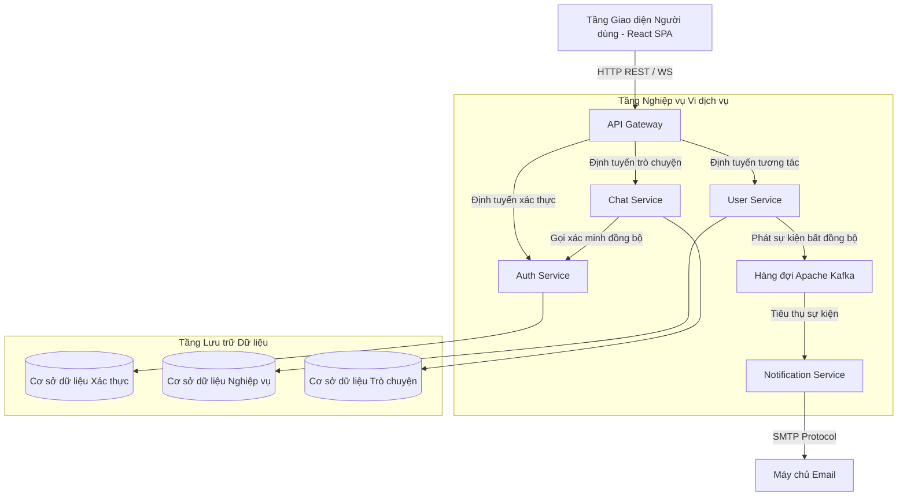

# CHƯƠNG 4: THIẾT KẾ VÀ TRIỂN KHAI HỆ THỐNG

## 4.1. KIẾN TRÚC VÀ MÔ TẢ TỔNG QUAN HỆ THỐNG

Hệ thống được thiết kế và xây dựng theo mô hình kiến trúc phân tán nhằm đáp ứng các tiêu chuẩn chất lượng của một mạng xã hội hiện đại. Phần này mô tả chi tiết mô hình kiến trúc vi dịch vụ, cơ chế giao tiếp liên dịch vụ và các giải pháp thiết kế đặc thù xử lý dữ liệu của hệ thống.

### 4.1.1. Kiến trúc hệ thống Vi dịch vụ (Microservices Architecture)

Hệ thống từ bỏ mô hình kiến trúc nguyên khối truyền thống để áp dụng kiến trúc vi dịch vụ (Microservices). Toàn bộ hệ thống được chia tách thành các dịch vụ độc lập về mặt nghiệp vụ, vận hành và lưu trữ dữ liệu. Kiến trúc phân tầng của hệ thống bao gồm:

1. **Tầng Giao diện Người dùng (Client Layer)**: Được xây dựng trên mô hình ứng dụng trang đơn (Single Page Application) sử dụng thư viện React JS. Tầng này chịu trách nhiệm hiển thị giao diện, thu nhận tương tác từ người dùng và gửi yêu cầu dịch vụ tới máy chủ.
2. **Tổng Cổng định tuyến (API Gateway)**: Sử dụng cấu hình Spring Cloud Gateway làm chốt chặn trung tâm cho toàn bộ luồng yêu cầu đi vào hệ thống. API Gateway thực hiện các chức năng: kiểm tra an ninh đầu vào, xử lý chính sách chia sẻ tài nguyên nguồn gốc chéo (CORS) và phân phối các yêu cầu đến đúng các dịch vụ nghiệp vụ phía sau.
3. **Dịch vụ Xác thực và Phân quyền (Authentication Service)**: Đảm nhận các nghiệp vụ về bảo mật tài khoản, bao gồm đăng ký thành viên mới, xác thực thông tin đăng nhập và cấp phát các thẻ bài truy cập (Access Token, Refresh Token) theo tiêu chuẩn bảo mật JWT.
4. **Dịch vụ Quản lý Nghiệp vụ Người dùng (User Service)**: Là dịch vụ nghiệp vụ chính của hệ thống, quản lý các thông tin cá nhân, mạng lưới bạn bè, các bài đăng trạng thái, lượt tương tác thích, hệ thống bình luận và các nhóm cộng đồng.
5. **Dịch vụ Trò chuyện thời gian thực (Chat Service)**: Quản lý các phiên hội thoại và tin nhắn thời gian thực. Dịch vụ này duy trì các kết nối ổn định phục vụ việc truyền tải dữ liệu trò chuyện tức thời.
6. **Dịch vụ Thông báo hệ thống (Notification Service)**: Vận hành ngầm để xử lý các tác vụ gửi thông báo trong ứng dụng và gửi email xác thực tài khoản cho người dùng qua giao thức SMTP.



### 4.1.2. Cơ chế truyền thông và tương tác giữa các dịch vụ (Inter-service Communication)

Các vi dịch vụ giao tiếp với nhau bằng hai mô hình truyền thông chính:

#### 1. Giao tiếp đồng bộ (Synchronous Communication)
Sử dụng giao thức truyền tải REST API thông qua công cụ khách hàng ảo OpenFeign. Khi một dịch vụ cần kiểm tra thông tin tức thời từ dịch vụ khác, nó sẽ gửi yêu cầu trực tiếp và tạm dừng chờ phản hồi. Ví dụ, khi người dùng mở kết nối WebSocket tại dịch vụ trò chuyện, dịch vụ này sẽ gọi đồng bộ sang dịch vụ xác thực để kiểm tra tính hợp lệ của mã Token trước khi cho phép người dùng tham gia phòng trò chuyện.

#### 2. Giao tiếp bất đồng bộ dựa trên sự kiện (Asynchronous Event-driven Communication)
Sử dụng hàng đợi thông điệp Apache Kafka làm trung gian truyền tin. Mô hình này giúp giải phóng các dịch vụ khỏi việc chờ đợi nhau, tăng tốc độ phản hồi cho người dùng. Khi có một hành động quan trọng xảy ra (như đăng ký tài khoản thành công), dịch vụ nguồn sẽ đóng gói thông tin vào một cấu trúc phong bì sự kiện (bao gồm ID sự kiện, loại sự kiện, thời điểm xảy ra và nội dung nghiệp vụ) rồi đẩy vào hàng đợi. Dịch vụ thông báo ở chế độ nền sẽ tự động nhận diện sự kiện và thực hiện công việc gửi thư xác nhận.

### 4.1.3. Các mô hình thiết kế và cơ chế xử lý dữ liệu đặc thù

#### A. Cơ chế xóa mềm (Soft Delete Pattern)
Để bảo đảm tính toàn vẹn tham chiếu của cơ sở dữ liệu quan hệ và lưu trữ tài nguyên phục vụ việc thống kê, hệ thống không sử dụng các lệnh xóa vật lý khỏi đĩa cứng. Toàn bộ các thực thể lớn đều được bổ sung trường trạng thái hoạt động. Khi người dùng thực hiện hành vi xóa (bài viết, bình luận, tin nhắn, nhóm), hệ thống chỉ cập nhật trường trạng thái này về giá trị ngưng hoạt động. Các truy vấn hiển thị trên giao diện sẽ tự động lọc bỏ các bản ghi có trạng thái ngưng hoạt động này.

#### B. Phân trang dựa trên con trỏ (Cursor-based Pagination)
Nhằm khắc phục các nhược điểm của phân trang truyền thống sử dụng Offset (như suy giảm tốc độ truy vấn khi dữ liệu lớn, trùng lặp bản ghi trên giao diện khi có bài đăng mới trong lúc người dùng cuộn màn hình), hệ thống áp dụng cơ chế phân trang dựa trên con trỏ cho Bảng tin (Newsfeed) và Lịch sử tin nhắn:
- Hệ thống sử dụng mốc thời gian tạo bản ghi làm con trỏ định vị.
- Thay vì yêu cầu bỏ qua một số lượng bản ghi nhất định, Client gửi yêu cầu kèm theo con trỏ thời gian của bản ghi cuối cùng đã nhận.
- Cơ sở dữ liệu thực hiện tìm kiếm trực tiếp các bản ghi có thời gian cũ hơn con trỏ, đảm bảo thời gian phản hồi nhanh và danh sách hiển thị không bị trùng lặp.

---

## 4.2. CƠ SỞ DỮ LIỆU VÀ THIẾT KẾ THỰC THỂ

Hệ thống sử dụng cơ sở dữ liệu quan hệ MySQL. Cấu trúc thực thể được tổ chức thành các bảng thông tin chi tiết dưới đây nhằm đảm bảo tính toàn vẹn dữ liệu.

### 4.2.1. Cấu trúc bảng `users` (Thông tin người dùng)
Bảng này lưu trữ toàn bộ thông tin đăng nhập, hồ sơ cá nhân và trạng thái tài khoản của người dùng.

| Tên trường | Kiểu dữ liệu | Ràng buộc | Mô tả chi tiết |
|---|---|---|---|
| `id` | `INT` | Khóa chính | Mã định danh duy nhất của người dùng |
| `email` | `VARCHAR(100)` | Duy nhất, Không trống | Địa chỉ thư điện tử dùng để đăng nhập hệ thống |
| `password` | `VARCHAR(255)` | Không được để trống | Mật khẩu tài khoản (đã mã hóa bảo mật) |
| `name` | `VARCHAR(100)` | Không được để trống | Họ và tên hiển thị trên trang cá nhân |
| `nick_name` | `VARCHAR(50)` | Tùy chọn | Tên biệt danh viết gọn |
| `avatar` | `VARCHAR(500)` | Tùy chọn | Đường dẫn ảnh đại diện người dùng |
| `cover_photo` | `VARCHAR(500)` | Tùy chọn | Đường dẫn ảnh bìa trang cá nhân |
| `bio` | `VARCHAR(250)` | Tùy chọn | Đoạn văn bản giới thiệu bản thân ngắn |
| `location` | `VARCHAR(100)` | Tùy chọn | Nơi sinh sống hiện tại |
| `education` | `VARCHAR(200)` | Tùy chọn | Trường học/Trình độ học vấn |
| `workplace` | `VARCHAR(200)` | Tùy chọn | Nơi làm việc hiện tại |
| `hometown` | `VARCHAR(100)` | Tùy chọn | Quê quán |
| `relationship` | `VARCHAR(50)` | Tùy chọn | Tình trạng mối quan hệ |
| `gender` | `VARCHAR(20)` | Tùy chọn | Giới tính |
| `pronouns` | `VARCHAR(50)` | Tùy chọn | Danh xưng cá nhân |
| `language` | `VARCHAR(50)` | Tùy chọn | Ngôn ngữ giao tiếp chính |
| `is_active` | `TINYINT(1)` | Mặc định hoạt động | Trạng thái tài khoản (1: Hoạt động, 0: Khóa) |
| `created_at` | `TIMESTAMP` | Thời gian hệ thống | Ngày giờ đăng ký tài khoản |

### 4.2.2. Cấu trúc bảng `posts` (Bài viết)
Lưu trữ thông tin nội dung các bài viết của người dùng hoặc các bài đăng trong nhóm cộng đồng.

| Tên trường | Kiểu dữ liệu | Ràng buộc | Mô tả chi tiết |
|---|---|---|---|
| `id` | `INT` | Khóa chính | Mã định danh bài viết |
| `user_id` | `INT` | Khóa ngoại | Mã người dùng tạo bài viết |
| `content` | `TEXT` | Không được để trống | Nội dung văn bản chia sẻ |
| `is_group_posted`| `TINYINT(1)` | Mặc định là không | Đánh dấu bài đăng trong nhóm hay trang cá nhân |
| `group_id` | `INT` | Khóa ngoại, Tùy chọn | Mã nhóm cộng đồng liên quan |
| `comment_count` | `INT` | Mặc định bằng 0 | Tổng số bình luận hiện có của bài viết |
| `like_count` | `INT` | Mặc định bằng 0 | Tổng số lượt tương tác thích bài viết |
| `is_active` | `TINYINT(1)` | Mặc định hoạt động | Trạng thái hiển thị (1: Hiển thị, 0: Xóa mềm) |
| `created_at` | `TIMESTAMP` | Thời gian hệ thống | Ngày giờ đăng tải bài viết |

### 4.2.3. Cấu trúc bảng `comments` (Bình luận)
Quản lý các bình luận gốc và hệ thống phản hồi hai cấp thông qua trường cha-con liên kết đệ quy.

| Tên trường | Kiểu dữ liệu | Ràng buộc | Mô tả chi tiết |
|---|---|---|---|
| `id` | `INT` | Khóa chính | Mã định danh bình luận |
| `post_id` | `INT` | Khóa ngoại | Bài viết chứa bình luận này |
| `parent_id` | `INT` | Khóa ngoại, Tùy chọn | Mã bình luận gốc cấp trên (nếu là phản hồi) |
| `user_id` | `INT` | Khóa ngoại | Người thực hiện bình luận |
| `content` | `TEXT` | Không được để trống | Nội dung văn bản của bình luận |
| `like_count` | `INT` | Mặc định bằng 0 | Số lượt thích bình luận |
| `reply_count` | `INT` | Mặc định bằng 0 | Số lượt phản hồi trực tiếp cho bình luận này |
| `is_active` | `TINYINT(1)` | Mặc định hoạt động | Trạng thái hoạt động (1: Bình thường, 0: Đã ẩn) |
| `created_at` | `TIMESTAMP` | Thời gian hệ thống | Ngày giờ tạo bình luận |

### 4.2.4. Cấu trúc bảng `user_friends` (Mối quan hệ bạn bè)
Quản lý trạng thái kết nối bạn bè giữa các tài khoản người dùng.

| Tên trường | Kiểu dữ liệu | Ràng buộc | Mô tả chi tiết |
|---|---|---|---|
| `user_id` | `INT` | Khóa chính, Khóa ngoại | Người gửi lời mời kết bạn |
| `friend_id` | `INT` | Khóa chính, Khóa ngoại | Người nhận lời mời kết bạn |
| `status` | `VARCHAR(20)` | Mặc định là chờ duyệt | Trạng thái (`PENDING`: Chờ, `ACCEPTED`: Bạn bè) |
| `created_at` | `TIMESTAMP` | Thời gian hệ thống | Thời điểm gửi yêu cầu kết bạn |
| `updated_at` | `TIMESTAMP` | Tùy chọn | Thời điểm chấp nhận yêu cầu kết bạn |

### 4.2.5. Cấu trúc bảng `groups` (Nhóm cộng đồng)
Lưu trữ thông tin của các nhóm cộng đồng được tạo lập trên hệ thống.

| Tên trường | Kiểu dữ liệu | Ràng buộc | Mô tả chi tiết |
|---|---|---|---|
| `id` | `INT` | Khóa chính | Mã định danh nhóm |
| `name` | `VARCHAR(150)` | Không được để trống | Tên gọi của nhóm cộng đồng |
| `avatar` | `VARCHAR(255)` | Tùy chọn | Ảnh đại diện của nhóm |
| `cover_photo` | `VARCHAR(255)` | Tùy chọn | Ảnh bìa của nhóm |
| `privacy` | `VARCHAR(20)` | Mặc định công khai | Chế độ riêng tư của nhóm (Công khai hoặc Kín) |
| `is_active` | `TINYINT(1)` | Mặc định hoạt động | Trạng thái nhóm (1: Hoạt động, 0: Giải tán) |
| `created_at` | `TIMESTAMP` | Thời gian hệ thống | Ngày giờ thành lập nhóm |

### 4.2.6. Cấu trúc bảng `user_group` (Thành viên nhóm)
Liên kết người dùng với các nhóm cộng đồng và xác định quyền hạn của họ trong nhóm.

| Tên trường | Kiểu dữ liệu | Ràng buộc | Mô tả chi tiết |
|---|---|---|---|
| `group_id` | `INT` | Khóa chính, Khóa ngoại | Mã nhóm cộng đồng |
| `user_id` | `INT` | Khóa chính, Khóa ngoại | Mã thành viên tham gia |
| `role` | `VARCHAR(20)` | Mặc định là thành viên | Quyền hạn trong nhóm (Quản trị viên, Thành viên) |
| `created_at` | `TIMESTAMP` | Thời gian hệ thống | Ngày giờ gia nhập nhóm |

### 4.2.7. Cấu trúc bảng `conversations` (Cuộc trò chuyện)
Lưu trữ thông tin về các phòng chat cá nhân hoặc nhóm chat.

| Tên trường | Kiểu dữ liệu | Ràng buộc | Mô tả chi tiết |
|---|---|---|---|
| `id` | `INT` | Khóa chính | Mã cuộc hội thoại |
| `is_group` | `TINYINT(1)` | Mặc định là không | Đánh dấu trò chuyện nhóm (1: Nhóm, 0: Cá nhân) |
| `name` | `VARCHAR(150)` | Tùy chọn | Tên nhóm chat (nếu là trò chuyện nhóm) |
| `is_active` | `TINYINT(1)` | Mặc định hoạt động | Trạng thái cuộc trò chuyện |
| `created_at` | `TIMESTAMP` | Thời gian hệ thống | Thời điểm tạo phòng chat |

### 4.2.8. Cấu trúc bảng `messages` (Tin nhắn)
Lưu trữ nội dung tin nhắn chi tiết thuộc các cuộc trò chuyện.

| Tên trường | Kiểu dữ liệu | Ràng buộc | Mô tả chi tiết |
|---|---|---|---|
| `id` | `INT` | Khóa chính | Mã định danh tin nhắn |
| `conversation_id`| `INT` | Khóa ngoại | Mã cuộc trò chuyện chứa tin nhắn |
| `sender_id` | `INT` | Khóa ngoại | Người gửi tin nhắn |
| `content` | `TEXT` | Không được để trống | Nội dung văn bản tin nhắn |
| `message_type` | `VARCHAR(20)` | Mặc định là văn bản | Định dạng tin nhắn (Văn bản, Hình ảnh,...) |
| `call_duration` | `INT` | Tùy chọn | Thời lượng cuộc gọi (nếu có cuộc gọi) |
| `is_active` | `TINYINT(1)` | Mặc định hoạt động | Trạng thái hoạt động (1: Hiển thị, 0: Thu hồi) |
| `created_at` | `TIMESTAMP` | Thời gian hệ thống | Thời điểm gửi tin nhắn |

---

## 4.3. PHÂN TÍCH VÀ THIẾT KẾ HỆ THỐNG QUA BIỂU ĐỒ CA SỬ DỤNG (USE CASE)

Biểu đồ ca sử dụng hỗ trợ trực quan hóa hành vi tương tác của các tác nhân với hệ thống mạng xã hội.

### 4.3.1. Sơ đồ ca sử dụng hệ thống

Dưới đây là sơ đồ ca sử dụng phân chia theo các nhóm nghiệp vụ chính của người dùng đã đăng nhập hệ thống:

```mermaid
usecaseDiagram
    actor "Thành viên hệ thống" as User
    
    rect "Quản lý Tương tác & Nội dung"
        User --> (Cập nhật hồ sơ cá nhân)
        User --> (Đăng bài viết trạng thái)
        User --> (Bình luận bài viết)
        User --> (Thích bài viết & bình luận)
    end
    
    rect "Quản lý Kết nối xã hội"
        User --> (Gửi yêu cầu kết bạn)
        User --> (Phản hồi yêu cầu kết bạn)
        User --> (Tham gia nhóm cộng đồng)
        User --> (Trò chuyện thời gian thực)
    end
```

### 4.3.2. Đặc tả chi tiết các ca sử dụng tiêu biểu

Dưới đây là các kịch bản đặc tả chi tiết về luồng nghiệp vụ khi người dùng thực hiện thao tác trên ứng dụng.

#### Bảng 4.1. Đặc tả ca sử dụng: Đăng ký tài khoản (UC-01)
| Thành phần đặc tả | Mô tả chi tiết kịch bản |
|---|---|
| **Mã Ca sử dụng** | UC-01 |
| **Tên Ca sử dụng** | Đăng ký tài khoản hệ thống |
| **Tác nhân** | Khách truy cập |
| **Mô tả tóm tắt** | Cho phép người dùng mới tạo tài khoản để sử dụng mạng xã hội. |
| **Tiền điều kiện** | Khách truy cập vào giao diện hệ thống và chưa có tài khoản đăng nhập. |
| **Hậu điều kiện** | Tài khoản được tạo ở trạng thái chưa kích hoạt. Mã OTP kích hoạt được gửi tới hòm thư người dùng. |
| **Luồng sự kiện chính** | 1. Người dùng chọn chức năng Đăng ký tài khoản trên màn hình chính.<br>2. Hệ thống hiển thị biểu mẫu yêu cầu nhập thông tin cá nhân.<br>3. Người dùng nhập: Họ tên, Email, Mật khẩu, Biệt danh và xác nhận.<br>4. Hệ thống kiểm tra định dạng dữ liệu đầu vào và kiểm tra trùng lặp email trong cơ sở dữ liệu.<br>5. Hệ thống thực hiện mã hóa mật khẩu và lưu trữ tài khoản với trạng thái chưa hoạt động.<br>6. Hệ thống tạo mã số kích hoạt ngẫu nhiên, lưu trữ tạm thời và gửi email thông báo.<br>7. Hệ thống chuyển hướng người dùng sang trang nhập mã kích hoạt OTP. |
| **Luồng ngoại lệ** | - **Email đã tồn tại**: Hệ thống dừng quy trình và đưa ra thông báo cảnh báo email đã được sử dụng.<br>- **Thiếu thông tin bắt buộc**: Biểu mẫu báo lỗi và yêu cầu điền đầy đủ các trường thông tin. |

#### Bảng 4.2. Đặc tả ca sử dụng: Đăng bài viết (UC-02)
| Thành phần đặc tả | Mô tả chi tiết kịch bản |
|---|---|
| **Mã Ca sử dụng** | UC-02 |
| **Tên Ca sử dụng** | Đăng bài viết trạng thái |
| **Tác nhân** | Thành viên hệ thống |
| **Mô tả tóm tắt** | Thành viên chia sẻ một dòng trạng thái văn bản lên bảng tin công cộng hoặc nhóm. |
| **Tiền điều kiện** | Người dùng đã đăng nhập thành công và sở hữu phiên làm việc hợp lệ. |
| **Hậu điều kiện** | Bài viết được lưu trữ thành công và hiển thị trên bảng tin của bạn bè hoặc nhóm. |
| **Luồng sự kiện chính** | 1. Người dùng nhấn chọn vào khu vực tạo bài viết ở trang chủ.<br>2. Hệ thống mở cửa sổ nhập liệu trạng thái.<br>3. Người dùng nhập nội dung văn bản chia sẻ và chọn Đăng bài.<br>4. Hệ thống tiếp nhận yêu cầu, kiểm tra độ dài nội dung (không quá 500 ký tự).<br>5. Hệ thống tiến hành ghi dữ liệu bài viết vào bảng bài viết và gán mã người đăng.<br>6. Bài đăng mới được hiển thị ngay lập tức lên trên giao diện bảng tin trang chủ của người dùng. |
| **Luồng ngoại lệ** | - **Nội dung rỗng**: Hệ thống từ chối đăng bài và yêu cầu người dùng nhập văn bản nội dung. |

#### Bảng 4.3. Đặc tả ca sử dụng: Gửi tin nhắn trò chuyện (UC-03)
| Thành phần đặc tả | Mô tả chi tiết kịch bản |
|---|---|
| **Mã Ca sử dụng** | UC-03 |
| **Tên Ca sử dụng** | Gửi tin nhắn thời gian thực |
| **Tác nhân** | Thành viên hệ thống |
| **Mô tả tóm tắt** | Gửi tin nhắn trò chuyện trực tiếp với một thành viên khác trong phòng hội thoại. |
| **Tiền điều kiện** | Người dùng đã đăng nhập và đang trong kết nối trực tuyến (WebSocket) với máy chủ trò chuyện. |
| **Hậu điều kiện** | Tin nhắn được chuyển tới người nhận ngay lập tức mà không có độ trễ nhận biết. |
| **Luồng sự kiện chính** | 1. Người dùng chọn một người dùng hoặc phòng trò chuyện từ danh sách hội thoại.<br>2. Nhập nội dung tin nhắn văn bản vào hộp nhập và chọn nút Gửi.<br>3. Hệ thống truyền tin nhắn qua kết nối socket bảo mật đang hoạt động.<br>4. Dịch vụ trò chuyện ghi nhận thông tin tin nhắn, lưu vào cơ sở dữ liệu tin nhắn.<br>5. Dịch vụ phát tín hiệu tin nhắn mới xuống kênh đăng ký của phòng trò chuyện.<br>6. Thiết bị người nhận tự động cập nhật và hiển thị tin nhắn mới trên màn hình chat. |
| **Luồng ngoại lệ** | - **Mất kết nối mạng**: Tin nhắn hiển thị trạng thái lỗi gửi và hệ thống yêu cầu kết nối lại. |

---

## 4.4. MÔ TẢ CHI TIẾT CÁC PHÂN HỆ CHỨC NĂNG NGHIỆP VỤ

Phần này mô tả chi tiết các phân hệ chức năng nghiệp vụ cơ bản của hệ thống, bao gồm quy trình xử lý, các ràng buộc dữ liệu nghiệp vụ và thiết kế các giao diện lập trình (API) tương ứng.

### 4.4.1. Phân hệ Xác thực và Quản lý Tài khoản (Authentication)

#### 1. Đăng ký tài khoản mới
- **Mục đích**: Cho phép khách truy cập đăng ký thông tin cá nhân để thiết lập tài khoản mới.
- **Quy trình xử lý**: Người dùng điền thông tin biểu mẫu. Hệ thống kiểm tra tính hợp lệ của địa chỉ email. Mật khẩu được mã hóa an toàn trước khi ghi nhận vào cơ sở dữ liệu. Trạng thái tài khoản ban đầu được đặt ngưng hoạt động. Hệ thống gửi mã OTP 6 chữ số qua hòm thư điện tử của người dùng để yêu cầu kích hoạt.
- **Ràng buộc nghiệp vụ**: Email không được phép trùng lặp trong hệ thống. Mật khẩu tối thiểu phải dài 8 ký tự.
- **Giao diện lập trình (API)**: Cung cấp cổng tiếp nhận yêu cầu dạng truyền dữ liệu POST thông qua địa chỉ định tuyến tài khoản `/auth/register`.

#### 2. Kích hoạt tài khoản bằng mã xác thực
- **Mục đích**: Xác thực địa chỉ email của người dùng để chuyển trạng thái tài khoản sang hoạt động.
- **Quy trình xử lý**: Người dùng nhập mã số xác thực gồm 6 chữ số nhận từ email. Hệ thống đối chiếu mã số này với mã số được lưu trong cơ sở dữ liệu. Nếu trùng khớp và chưa quá thời gian hiệu lực 15 phút, tài khoản được cập nhật trạng thái hoạt động.
- **Ràng buộc nghiệp vụ**: Mã xác thực phải đúng định dạng và còn hạn sử dụng.
- **Giao diện lập trình (API)**: Tiếp nhận yêu cầu dạng POST thông qua địa chỉ `/auth/active` kèm theo tham số email và mã kích hoạt.

#### 3. Đăng nhập hệ thống
- **Mục đích**: Xác thực thông tin người dùng đăng nhập để cấp quyền truy cập các tính năng.
- **Quy trình xử lý**: Người dùng cung cấp email và mật khẩu. Hệ thống đối chiếu thông tin trong cơ sở dữ liệu. Nếu chính xác, hệ thống cấp phát thẻ bài truy cập Access Token để lưu tạm trên trình duyệt máy khách và thẻ bài Refresh Token lưu dưới dạng Cookie bảo mật cao của trình duyệt.
- **Giao diện lập trình (API)**: Tiếp nhận yêu cầu dạng POST qua địa chỉ `/auth/login` với dữ liệu gồm email và mật khẩu.

#### 4. Tự động làm mới phiên đăng nhập (Refresh Token)
- **Mục đích**: Duy trì trạng thái đăng nhập của người dùng một cách an toàn mà không yêu cầu đăng nhập lại khi Access Token hết hạn.
- **Quy trình xử lý**: Khi Access Token hết hạn (sau 15 phút), trình duyệt tự động gửi mã Refresh Token lưu trong Cookie lên máy chủ. Hệ thống xác minh tính hợp lệ của Refresh Token để cấp phát Access Token mới. Nếu Refresh Token hết hạn (sau 7 ngày), hệ thống yêu cầu người dùng đăng nhập lại từ đầu.
- **Giao diện lập trình (API)**: Tiếp nhận yêu cầu dạng POST qua địa chỉ `/auth/refresh-token`.

---

### 4.4.2. Phân hệ Thông tin hồ sơ cá nhân (User Profile)

#### 1. Truy xuất thông tin trang cá nhân
- **Mục đích**: Hiển thị các thông tin chi tiết của một tài khoản người dùng và trạng thái quan hệ bạn bè hiện tại của họ với người xem.
- **Quy trình xử lý**: Hệ thống truy vấn thông tin cá nhân từ cơ sở dữ liệu người dùng. Đồng thời, hệ thống thực hiện kiểm tra chéo trong bảng quan hệ bạn bè để xác định trạng thái kết nối (đã kết bạn, đang chờ đồng ý, chưa kết bạn) và trả về trạng thái tương ứng để Client hiển thị các nút chức năng.
- **Giao diện lập trình (API)**: Tiếp nhận yêu cầu dạng GET qua địa chỉ `/users/profile/{profileUserId}` với tham số kèm theo là ID người dùng đang thực hiện truy cập.

#### 2. Cập nhật thông tin hồ sơ
- **Mục đích**: Cho phép người dùng chỉnh sửa các thông tin giới thiệu bản thân trên trang cá nhân.
- **Quy trình xử lý**: Người dùng gửi các thông tin thay đổi (như tiểu sử, nơi sống, trường học, tình trạng mối quan hệ,...). Hệ thống kiểm tra tính hợp lệ và thực hiện cập nhật thông tin trong bảng cơ sở dữ liệu người dùng.
- **Giao diện lập trình (API)**: Tiếp nhận yêu cầu dạng PUT qua địa chỉ `/users/profile/{userId}` chứa phần nội dung thông tin cập nhật mới.

#### 3. Cập nhật ảnh đại diện và ảnh bìa
- **Mục đích**: Thay đổi hình ảnh đại diện hoặc ảnh bìa hiển thị trên mạng xã hội.
- **Quy trình xử lý**: Người dùng chọn tệp tin ảnh. Client gửi ảnh dưới dạng luồng dữ liệu đa phần (Multipart Form). Hệ thống lưu tệp tin ảnh vào thư mục lưu trữ tĩnh của máy chủ và cập nhật liên kết đường dẫn ảnh mới vào thông tin người dùng trong cơ sở dữ liệu.
- **Giao diện lập trình (API)**: Tiếp nhận yêu cầu dạng POST qua địa chỉ tải ảnh `/users/profile/{userId}/upload-avatar` (hoặc `/upload-cover`).

---

### 4.4.3. Phân hệ Quản lý Bài viết (Post Management)

#### 1. Đăng bài viết mới
- **Mục đích**: Cho phép người dùng đăng tải các chia sẻ trạng thái bằng văn bản cá nhân hoặc đăng trong các nhóm.
- **Quy trình xử lý**: Hệ thống nhận nội dung văn bản. Thực hiện kiểm tra độ dài văn bản (tối đa 500 ký tự). Ghi nhận bản ghi bài viết mới vào cơ sở dữ liệu bài viết với cờ hoạt động hiển thị.
- **Giao diện lập trình (API)**: Tiếp nhận yêu cầu dạng POST qua địa chỉ `/users/posts` với nội dung bài viết và ID người đăng.

#### 2. Tải danh sách bài viết trang bảng tin (Newsfeed)
- **Mục đích**: Hiển thị danh sách các bài viết mới từ mạng xã hội cho người dùng cuộn xem.
- **Quy trình xử lý**: Hệ thống sử dụng phân trang con trỏ (Cursor-based). Client truyền mốc thời gian của bài đăng cũ nhất đã tải. Cơ sở dữ liệu thực hiện quét chỉ mục thời gian và trả về danh sách các bài đăng tiếp theo cũ hơn mốc thời gian đó, kèm theo cờ thông báo còn dữ liệu hay không.
- **Giao diện lập trình (API)**: Tiếp nhận yêu cầu dạng GET qua địa chỉ `/users/posts/suggested` kèm các tham số ID người dùng, mốc thời gian con trỏ và kích thước trang.

#### 3. Tương tác thích bài viết
- **Mục đích**: Cho phép người dùng bày tỏ sự yêu thích bài viết hoặc rút lại lượt thích.
- **Quy trình xử lý**: Hệ thống kiểm tra xem người dùng đã thích bài viết này trước đó chưa. Nếu chưa, tạo bản ghi liên kết mới trong bảng thích bài viết và cộng 1 vào tổng số lượt thích của bài viết. Nếu đã thích, xóa bản ghi liên kết và trừ 1 khỏi tổng số lượt thích của bài viết.
- **Giao diện lập trình (API)**: Tiếp nhận yêu cầu dạng POST qua địa chỉ `/users/posts/{postId}/like` kèm theo ID người dùng tương tác.

#### 4. Xóa bài viết
- **Mục đích**: Cho phép người dùng gỡ bỏ bài viết đã đăng.
- **Quy trình xử lý**: Kiểm tra quyền sở hữu bài viết của người gửi yêu cầu. Nếu chính xác, hệ thống cập nhật trạng thái hoạt động của bài viết về ngưng hoạt động (xóa mềm), gỡ bỏ bài đăng khỏi bảng tin hiển thị.
- **Giao diện lập trình (API)**: Tiếp nhận yêu cầu dạng DELETE qua địa chỉ `/users/posts/{postId}` kèm theo ID người dùng yêu cầu xóa.

---

### 4.4.4. Phân hệ Quản lý Bình luận (Comment & Reply)

#### 1. Tạo bình luận hoặc phản hồi bình luận
- **Mục đích**: Cho phép người dùng tương tác thảo luận dưới bài viết bằng cách viết bình luận mới hoặc phản hồi bình luận của người khác.
- **Quy trình xử lý**: Hệ thống nhận văn bản bình luận. Nếu là phản hồi cấp hai, hệ thống gán mã ID của bình luận gốc vào trường cha và tăng số đếm lượt phản hồi của bình luận cha lên 1. Hệ thống đồng thời tăng số đếm tổng bình luận của bài viết lên 1.
- **Ràng buộc nghiệp vụ**: Nội dung văn bản bình luận không được để trống và có độ dài tối đa là 250 ký tự.
- **Giao diện lập trình (API)**: Tiếp nhận yêu cầu dạng POST qua địa chỉ `/comments` chứa thông tin bài viết, nội dung và ID bình luận cha (nếu có).

#### 2. Tải danh sách bình luận bài viết
- **Mục đích**: Tải danh sách các bình luận dưới bài viết hiển thị cho người xem, hỗ trợ phân trang con trỏ thời gian để người dùng cuộn xem dần.
- **Giao diện lập trình (API)**: Tiếp nhận yêu cầu dạng GET qua địa chỉ `/comments` kèm theo ID bài viết cần xem.

---

### 4.4.5. Phân hệ Mạng lưới bạn bè (Friends & Connections)

#### 1. Gửi yêu cầu kết bạn
- **Mục đích**: Khởi tạo yêu cầu thiết lập mối quan hệ bạn bè với một tài khoản người dùng khác.
- **Quy trình xử lý**: Hệ thống kiểm tra tính hợp lệ của hai tài khoản. Kiểm tra xem giữa hai người đã có quan hệ bạn bè hoặc lời mời đang chờ xử lý nào chưa. Nếu chưa, tạo một dòng thông tin trạng thái chờ (`PENDING`) trong bảng liên kết bạn bè.
- **Giao diện lập trình (API)**: Tiếp nhận yêu cầu dạng POST qua địa chỉ gửi yêu cầu kết bạn `/users/friends/request` kèm ID người gửi và người nhận.

#### 2. Chấp nhận hoặc từ chối kết bạn
- **Mục đích**: Phản hồi yêu cầu kết bạn nhận được từ người khác.
- **Quy trình xử lý**: 
  - Nếu đồng ý kết bạn: Hệ thống cập nhật bản ghi yêu cầu ban đầu sang trạng thái đã chấp nhận (`ACCEPTED`), đồng thời tự động chèn một bản ghi ánh xạ ngược chiều trạng thái đã chấp nhận để xây dựng quan hệ bạn bè hai chiều đối xứng.
  - Nếu từ chối kết bạn: Hệ thống tiến hành xóa bản ghi yêu cầu kết bạn đang chờ khỏi bảng liên kết bạn bè.
- **Giao diện lập trình (API)**: Tiếp nhận yêu cầu dạng POST qua địa chỉ `/users/friends/respond` kèm ID người gửi, người nhận và cờ đồng ý/từ chối.

#### 3. Tải danh sách gợi ý kết bạn
- **Mục đích**: Gợi ý những người dùng quen biết giúp người dùng mở rộng mạng lưới bạn bè.
- **Quy trình xử lý**: Hệ thống thực hiện giải thuật truy vấn tìm kiếm những tài khoản có chung bạn bè với người dùng hiện tại (bạn của bạn) nhưng bản thân chưa có quan hệ kết nối với người dùng hiện tại. Sắp xếp danh sách gợi ý theo số lượng bạn chung từ cao xuống thấp.
- **Giao diện lập trình (API)**: Tiếp nhận yêu cầu dạng GET qua địa chỉ gợi ý kết nối `/users/friends/suggested` kèm ID người dùng hiện tại.

---

### 4.4.6. Phân hệ Nhóm cộng đồng (Group & Community)

#### 1. Khởi tạo nhóm cộng đồng mới
- **Mục đích**: Cho phép người dùng thành lập một không gian cộng đồng mới để thảo luận về một chủ đề chung.
- **Quy trình xử lý**: Người dùng cung cấp tên nhóm và chế độ riêng tư (Công khai hoặc Kín). Hệ thống tạo bản ghi nhóm mới, đồng thời tự động chèn dòng liên kết gán quyền quản trị viên (`ADMIN`) cho người tạo nhóm trong bảng thành viên nhóm.
- **Giao diện lập trình (API)**: Tiếp nhận yêu cầu dạng POST qua địa chỉ tạo nhóm `/users/groups` kèm ID người tạo.

#### 2. Tham gia hoặc rời khỏi nhóm
- **Mục đích**: Trở thành thành viên của nhóm để xem và đăng tải nội dung hoặc rời khỏi nhóm khi không muốn tham gia.
- **Quy trình xử lý**:
  - Tham gia nhóm: Hệ thống kiểm tra và chèn dòng liên kết thành viên mới trong bảng thành viên nhóm với vai trò thành viên mặc định.
  - Rời khỏi nhóm: Hệ thống xóa dòng liên kết thành viên khỏi bảng thành viên nhóm. Nếu người rời đi là Quản trị viên duy nhất, hệ thống yêu cầu chỉ định Quản trị viên mới trước khi thực hiện.
- **Giao diện lập trình (API)**: Tiếp nhận yêu cầu dạng POST qua địa chỉ tương tác `/users/groups/{groupId}/join` hoặc `/users/groups/{groupId}/leave`.

#### 3. Đăng bài đăng trong nhóm
- **Mục đích**: Cho phép thành viên chia sẻ thông tin trong nhóm cộng đồng.
- **Ràng buộc nghiệp vụ**: Tài khoản gửi bài đăng bắt buộc phải là thành viên hiện tại của nhóm đó. Đối với các nhóm riêng tư (Kín), người ngoài không có quyền xem và đăng bài viết.
- **Giao diện lập trình (API)**: Tiếp nhận yêu cầu đăng bài dạng POST qua địa chỉ bài viết chung kèm theo ID nhóm.

---

### 4.4.7. Phân hệ Trò chuyện trực tuyến (Real-time Messenger)

#### 1. Khởi tạo phiên hội thoại chat
- **Mục đích**: Thiết lập phòng chat cá nhân hoặc nhóm chat giữa các thành viên.
- **Quy trình xử lý**: Khi người dùng chọn nhắn tin với tài khoản khác, hệ thống tìm kiếm cuộc trò chuyện hai thành viên đã tồn tại giữa họ. Nếu có, trả về ID cuộc trò chuyện cũ. Nếu chưa, tạo cuộc trò chuyện mới trong bảng hội thoại và thêm các liên kết thành viên tương ứng.
- **Giao diện lập trình (API)**: Tiếp nhận yêu cầu dạng POST qua địa chỉ hội thoại `/chat/conversations` kèm ID người tạo và người nhận.

#### 2. Tải lịch sử nhắn tin phòng chat
- **Mục đích**: Tải các tin nhắn cũ trong phòng chat khi người dùng mở hộp hội thoại.
- **Quy trình xử lý**: Hệ thống truy xuất lịch sử tin nhắn từ cơ sở dữ liệu tin nhắn, sử dụng phân trang con trỏ thời gian của tin nhắn cũ nhất đã nhận để hỗ trợ thao tác cuộn ngược màn hình tải thêm lịch sử nhắn tin của máy khách.
- **Giao diện lập trình (API)**: Tiếp nhận yêu cầu dạng GET qua địa chỉ `/chat/conversations/{conversationId}/messages` kèm theo tham số con trỏ và kích thước trang cần tải.

#### 3. Giao thức gửi nhận tin nhắn thời gian thực qua WebSocket STOMP
- **Mục đích**: Truyền tải tin nhắn tức thời giữa các tài khoản đang trực tuyến.
- **Quy trình xử lý**:
  - Khi người dùng soạn văn bản và nhấn gửi, Client gửi gói tin nhắn thông qua đường truyền socket TCP đến điểm nhận của máy chủ trò chuyện.
  - Máy chủ tiếp nhận tin nhắn, xác định thông tin người gửi, ghi nhận tin nhắn vào cơ sở dữ liệu.
  - Máy chủ tự động phát tín hiệu chứa nội dung tin nhắn hoàn chỉnh xuống kênh phân phối của phòng chat.
  - Các thiết bị của thành viên đang mở phòng chat này sẽ tự động nhận diện gói tin và hiển thị tin nhắn mới lên màn hình chat mà không cần tải lại trang.

#### 4. Cơ chế hiển thị trạng thái đang nhập liệu (Typing Indicator)
- **Mục đích**: Hiển thị dòng trạng thái "đang nhập tin nhắn..." trên màn hình của người nhận để tăng độ tương tác trực quan.
- **Quy trình xử lý**: Khi người dùng bắt đầu nhấn phím gõ chữ trong ô chat, Client gửi một tín hiệu thông báo đang gõ chữ lên máy chủ trò chuyện. Máy chủ lập tức chuyển tiếp tín hiệu này xuống kênh đăng ký của đối phương để hiển thị hiệu ứng ba chấm động. Khi người dùng dừng gõ chữ hoặc gửi tin nhắn, Client gửi tín hiệu tắt trạng thái gõ để ẩn hiệu ứng.

---

## 4.5. THIẾT KẾ KIẾN TRÚC MÃ NGUỒN VÀ TRIỂN KHAI HỆ THỐNG

### 4.5.1. Mô hình tổ chức mã nguồn (Project Architecture)

Để phát triển ứng dụng một cách khoa học, mã nguồn của hệ thống được tổ chức phân tầng rõ ràng về mặt kiến trúc.

#### 1. Phân tầng mã nguồn phía Máy chủ (Backend Architecture)
Mỗi dịch vụ Spring Boot nghiệp vụ được cấu trúc tách biệt trách nhiệm qua các lớp:
- **Tầng Trình điều khiển (Controller Layer)**: Nơi tiếp nhận trực tiếp các yêu cầu kết nối đầu vào từ Client, thực hiện kiểm tra sơ bộ dữ liệu biểu mẫu và định hình dữ liệu đầu ra.
- **Tầng Dịch vụ Nghiệp vụ (Service Layer)**: Nơi xử lý toàn bộ logic nghiệp vụ của ứng dụng, điều phối luồng dữ liệu và quản lý các giao dịch cơ sở dữ liệu.
- **Tầng Truy cập Dữ liệu (Repository Layer)**: Cung cấp các phương thức tương tác trực tiếp với cơ sở dữ liệu quan hệ MySQL thông qua các giao diện kế thừa thư viện JPA.
- **Tầng Đối tượng Trao đổi và Thực thể (Entities & DTOs)**: Entities ánh xạ trực tiếp các dòng bảng dưới cơ sở dữ liệu thành đối tượng Java, trong khi DTOs đóng gói dữ liệu phục vụ quá trình truyền tải thông tin qua mạng.

#### 2. Phân tầng mã nguồn phía Máy khách (Client Architecture)
Ứng dụng React JS tuân thủ mô hình thiết kế Component-Driven hướng thành phần và quản lý trạng thái tập trung:
- **Tầng Hiển thị (Views & Components)**: Chứa giao diện người dùng hiển thị trực quan, thực hiện bố cục các trang màn hình và các khối giao diện nhỏ.
- **Tầng Nghiệp vụ (Custom Hooks)**: Nơi chứa toàn bộ logic xử lý, kiểm soát hoạt động tải dữ liệu, tương tác với store quản lý trạng thái và liên kết tới các lớp dịch vụ API.
- **Tầng Quản lý Trạng thái (Redux Slices)**: Store trung tâm lưu trữ toàn bộ trạng thái hoạt động của Client (thông tin đăng nhập, danh sách bài đăng hiện tại, lịch sử chat) giúp dữ liệu được chia sẻ và đồng bộ tức thời xuyên suốt toàn bộ các màn hình giao diện.
- **Tầng Dịch vụ Kết nối (API Services)**: Lớp dịch vụ HTTP Client thực hiện gửi nhận yêu cầu qua mạng đến cổng kết nối API Gateway, xử lý đóng bọc kết quả phản hồi thô.

---

### 4.5.2. Quy trình đóng gói và triển khai ứng dụng trên môi trường Docker

Để đảm bảo hệ thống vận hành đồng nhất từ môi trường phát triển máy cá nhân cho tới môi trường máy chủ chạy thử nghiệm thực tế, hệ thống ứng dụng giải pháp đóng gói ảo hóa thùng chứa **Docker**.

1. **Đóng gói mã nguồn thành Docker Image**: Mỗi dịch vụ Spring Boot riêng biệt đều được thiết lập tệp tin đóng gói Dockerfile chuyên dụng. Quá trình biên dịch và xuất bản tệp tin chạy định dạng JAR được thực hiện độc lập trong một thùng chứa xây dựng tạm thời (Build Container), sau đó tệp tin chạy cuối cùng được sao chép sang một thùng chứa chạy nhỏ gọn (Runtime Container) để khởi chạy. Phương pháp này giảm thiểu tối đa kích thước tệp ảnh Docker và loại bỏ các thành phần mã nguồn dư thừa.
2. **Điều phối hệ thống qua Docker Compose**: Để khởi động đồng loạt hệ thống gồm nhiều dịch vụ nghiệp vụ, máy chủ cơ sở dữ liệu MySQL độc lập và hệ thống hàng đợi thông điệp Apache Kafka, tệp tin cấu hình điều phối hệ thống được xây dựng. Tệp tin này quy định cụ thể các cổng mạng được ánh xạ ra ngoài, các thư mục lưu trữ dữ liệu bền vững của cơ sở dữ liệu, các mạng ảo kết nối nội bộ giữa các container và thứ tự khởi chạy phù hợp (ví dụ: máy chủ cơ sở dữ liệu và hàng đợi Kafka phải khởi động hoạt động thành công trước khi các dịch vụ vi dịch vụ Spring Boot được phép chạy). Quy trình này cho phép thiết lập nhanh chóng toàn bộ môi trường chạy chỉ bằng một câu lệnh điều khiển thống nhất.
